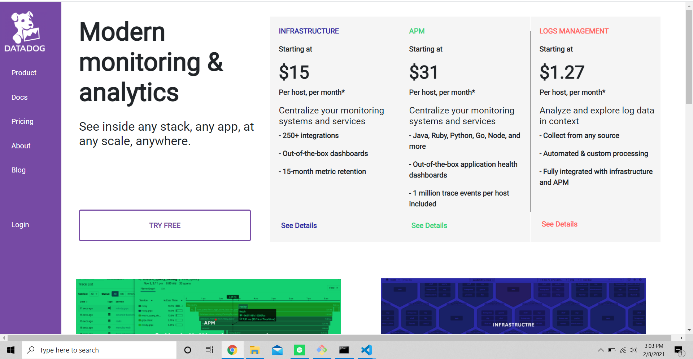

# Datadog
<h1>My datadog take-home assignment!</h1>

<h2>The URL for the project: http://aladindatadog.surge.sh/ </h2>
<h2>I tried desperately to deploy the application using AWS S3 buckets or even AWS Amplify, but I underestimated HUGO's complexities and rules when it comes to deploying to Production. AWS Link: https://main.d3w349jo24gbjn.amplifyapp.com/</h2>

<h2>For some reason, the SCSS wasn't being applied when using AWS. Rather than asking for an extension to the submission deadline, I decided to deploy it using another service instead of wasting any of your time</h2>

<h2>Please keep in mind, as a MERN stack developer I've never worked with many of these technologies before (including Hugo, GO templating, S3, etc).</h2>

<h2>However, I still managed to learn Hugo's framework in a rather short time and am proud of that. I definitely see the benefit in using Hugo and I believe with a bit of guidance, I can become very comfortable using it!</h2>

